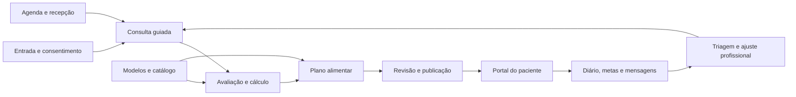

# Plano de desenvolvimento do BSNutri: do MVP à V1

Atualizado em 17 de julho de 2026.

## 1. Objetivo do próximo ciclo

O MVP já prova as três jornadas essenciais: profissional, recepção e paciente. O próximo ciclo deve transformar essa base em um produto utilizável na rotina real de uma clínica, sem tentar copiar integralmente plataformas que levaram anos para amadurecer.

O alvo da V1 é este:

1. conduzir uma consulta nutricional do cadastro ao acompanhamento;
2. reduzir o tempo para montar e revisar um plano alimentar;
3. permitir que o paciente registre o que aconteceu entre consultas;
4. manter agenda, documentos e comunicação no mesmo fluxo;
5. preservar isolamento entre clínicas, papéis e pacientes;
6. gerar informação suficiente para o profissional ajustar a conduta;
7. funcionar bem no navegador do computador e do celular.

O BSNutri não precisa competir agora por quantidade de recursos. Precisa ter um fluxo clínico melhor amarrado, linguagem mais cuidadosa sobre adesão e uma base técnica segura para crescer.

## 2. Ponto de partida confirmado

O mapeamento do repositório com Graphify e a leitura do schema mostram que já existem:

1. autenticação e papéis de `profissional`, `recepcao` e `paciente`;
2. isolamento por organização com RLS;
3. cadastro de pacientes e responsáveis;
4. avaliações, antropometria, consentimentos e exames laboratoriais;
5. catálogo próprio de alimentos e nutrientes;
6. planos com dias, refeições, itens, metas e cálculo nutricional;
7. rascunho, revisão, publicação imutável e histórico de versões;
8. substituições controladas e solicitações de troca;
9. lista de compras derivada do plano publicado;
10. agenda com prevenção de conflito de profissional e sala;
11. check-in de refeições, alertas de adesão e triagem profissional;
12. portal do paciente com plano vigente, agenda e registros;
13. deploy automatizado, testes de frontend e testes SQL centrais.

Essa base é mais importante do que parece. Versionamento imutável, RLS e separação entre recepção e dados clínicos costumam ser difíceis de acrescentar depois. No BSNutri, já fazem parte do núcleo.

## 3. Referências de mercado

As funcionalidades abaixo foram levantadas nas páginas e centrais de ajuda oficiais em 17 de julho de 2026. Elas servem como referência de fluxo, não como especificação para copiar interface, textos ou regras proprietárias.

### 3.1 Dietbox

O Dietbox organiza o produto em cinco blocos: atendimento, fidelização, gestão, estudo e divulgação. No atendimento, oferece planos calculados ou livres, protocolos de antropometria e gasto energético, solicitação de exames, questionário pré-consulta, recordatório, anamnese, suplementos e fitoterápicos. O aplicativo do paciente reúne plano, lista de compras, diário, metas, hidratação, agenda, chat, vídeo e gráficos. Na gestão, há acesso de secretária, agenda online, financeiro e relatórios.

Como funciona na prática:

1. o profissional recebe dados antes da consulta por questionários;
2. durante a consulta, consulta prontuário, avaliação e exames;
3. monta uma prescrição calculada ou qualitativa;
4. entrega o plano no aplicativo;
5. o paciente registra refeições e acompanha metas;
6. lembretes, chat e agenda mantêm o contato entre consultas;
7. recepção e financeiro ficam próximos do fluxo clínico, mas com acesso próprio.

O que vale trazer para o BSNutri:

1. questionário pré-consulta ligado ao prontuário;
2. planos calculados e qualitativos no mesmo editor;
3. metas, hidratação e diário na página inicial do paciente;
4. automações simples de agenda e WhatsApp;
5. relatórios de operação da clínica;
6. prescrição de suplementos separada do item alimentar.

Fonte: [site oficial do Dietbox](https://dietbox.me/pt-BR).

### 3.2 WebDiet

O WebDiet trabalha com modelos de prescrição e três métodos principais: alimentos, equivalentes e qualitativo. Também reúne anamnese personalizável, questionários de saúde, cálculo energético, avaliação antropométrica, metas, chat, videochamada, financeiro, integração com Google Agenda e automações de WhatsApp. No aplicativo profissional, agenda, chat, fotos e diário podem ser consultados, mas a edição do planejamento alimentar permanece na versão web. No aplicativo do paciente, o plano pode ser periodizado e o diário aceita fotos.

Como funciona na prática:

1. o profissional escolhe um modelo ou inicia uma prescrição vazia;
2. define se trabalhará com alimentos, equivalentes ou orientação qualitativa;
3. usa cálculo energético e avaliação para apoiar a definição de metas;
4. publica o plano correto para cada período ou tipo de dia;
5. o paciente consulta o plano vigente e envia fotos das refeições;
6. o profissional acompanha pelo celular, mas faz a edição complexa no navegador;
7. agenda e WhatsApp automatizam mensagens administrativas.

O que vale trazer para o BSNutri:

1. editor web completo e experiência móvel de consulta rápida;
2. periodização por tipo de dia, treino, descanso ou fim de semana;
3. modelos próprios da clínica;
4. diário fotográfico;
5. questionários clínicos configuráveis;
6. integração com calendário sem colocar informação clínica no evento externo.

Fontes: [visão geral do WebDiet](https://webdiet.com.br/site/), [aplicativo do paciente](https://webdiet.com.br/app/) e [aplicativo profissional](https://ajuda.webdiet.com.br/aplicativo-do-profissional).

### 3.3 Nutrium

O Nutrium usa um fluxo de consulta bem definido: informações, acompanhamento, medições, planejamento, refeições, recomendações, análise e entregáveis. Ele permite modelos de planos, receitas, medidas caseiras, dias diferentes, equivalentes automáticos, análise de macro e micronutrientes e entrega por aplicativo, e-mail ou PDF. No aplicativo, o paciente registra diário, água, atividade, peso, refeições cumpridas, adaptadas ou puladas, mensagens e lista de compras.

O cálculo de equivalentes é um bom exemplo de apoio sem retirar a decisão profissional. O nutricionista escolhe se a equivalência será por energia, proteína, carboidrato ou gordura. O sistema calcula a quantidade equivalente e mostra o impacto nos outros nutrientes. A opção continua editável e precisa ser escolhida pelo profissional.

Como funciona na prática:

1. a consulta avança por etapas, sem obrigar o preenchimento de tudo;
2. planejamento e medições alimentam a construção do plano;
3. um modelo pode ser duplicado e adaptado ao paciente;
4. o sistema calcula porções e equivalentes, mas mostra as diferenças;
5. a análise compara energia, macros e micronutrientes;
6. o profissional escolhe o que será entregue;
7. o paciente acessa o plano e registra contexto entre consultas.

O que vale trazer para o BSNutri:

1. consulta guiada por etapas;
2. importação de modelo sem vínculo mutável com o original;
3. receitas com rendimento, porções e medidas caseiras;
4. equivalentes automáticos revisados;
5. análise nutricional completa antes da publicação;
6. escolha explícita dos entregáveis;
7. check-in simples na página inicial do paciente.

Fontes: [primeiros passos no Nutrium](https://help.nutrium.com/pt-BR/articles/1596018-os-primeiros-passos-com-o-nutrium), [modelos de plano alimentar](https://help.nutrium.com/pt-BR/articles/595939-o-nutrium-possui-planos-alimentares-modelo), [equivalentes automáticos](https://help.nutrium.com/pt/articles/7068252-como-fazer-o-calculo-automatico-dos-alimentos-equivalentes) e [guia do aplicativo do paciente](https://help.nutrium.com/pt-BR/articles/4325678-guia-de-utilizacao-do-aplicativo-nutrium-para-clientes).

### 3.4 Healthie

O Healthie é menos centrado na prescrição nutricional e mais forte em operação clínica, formulários e acompanhamento. O recurso de Care Plan combina recomendações, metas, documentos e configuração do diário. Um modelo pode ser aplicado ao paciente, personalizado e ativado. Apenas o plano ativo fica visível, enquanto os anteriores permanecem no histórico.

O construtor de formulários separa três usos:

1. formulários de entrada para o paciente preencher antes do atendimento;
2. modelos de prontuário para o profissional preencher durante a consulta;
3. formulários recorrentes para acompanhamento semanal ou mensal.

Os formulários aceitam campos obrigatórios, múltipla escolha, matriz, imagem, assinatura, campos condicionais e campos inteligentes que atualizam o cadastro. O portal do paciente também pode ter recursos ativados ou desativados por paciente ou grupo.

O que vale trazer para o BSNutri:

1. formulários versionados por finalidade;
2. fluxos diferentes para adulto, pediatria, esporte ou gestação;
3. plano de acompanhamento que combina recomendações, metas e materiais;
4. ativação de recursos do portal por paciente;
5. programas recorrentes de acompanhamento;
6. pacotes e pagamentos apenas depois que agenda e serviços estiverem estáveis.

Fontes: [Care Plans do Healthie](https://help.gethealthie.com/article/371-care-plans), [construtor de formulários](https://help.gethealthie.com/article/960-form-builder-create-an-intake-form-in-healthie), [configuração do portal](https://help.gethealthie.com/article/656-client-portal-settings) e [pacotes de serviços](https://help.gethealthie.com/article/190-building-client-packages-to-charge-for-sessions).

## 4. Direção escolhida para o BSNutri

O produto deve combinar quatro qualidades:

1. rigor do plano publicado e do histórico clínico;
2. consulta guiada e rápida para o profissional;
3. acompanhamento simples e não punitivo para o paciente;
4. operação enxuta para recepção e clínica.

### 4.1 Decisões para a V1

1. Continuar com React, TypeScript, Vite e Supabase.
2. Manter o editor completo de plano na web.
3. Transformar o portal do paciente em PWA antes de considerar aplicativo nativo.
4. Usar modelos copiáveis, nunca referências mutáveis que alterem pacientes antigos.
5. Manter publicação imutável para plano, recomendação e documento clínico entregue.
6. Guardar cálculo e origem dos dados usados na publicação.
7. Tratar diário e adesão como relato contextual, não como nota de obediência.
8. Usar IA apenas para rascunho, resumo e sugestão revisável em fases futuras.
9. Não importar TACO ou TBCA em massa sem fechar licença e rastreabilidade.
10. Não iniciar financeiro completo, marketplace, academia de cursos ou Body3D antes da V1.

### 4.2 Superfícies do produto

| Superfície | Trabalho principal |
| --- | --- |
| Profissional | consultar, avaliar, calcular, prescrever, publicar e acompanhar |
| Recepção | cadastrar dados mínimos, organizar agenda, confirmar presença e registrar pagamento administrativo autorizado |
| Paciente ou responsável | preencher formulários, consultar entregas, registrar rotina, solicitar agenda e conversar |
| Gestor da clínica | configurar equipe, serviços, permissões, modelos, marca e relatórios operacionais |

## 5. Arquitetura funcional da V1

O fluxo deve ser circular. O registro do paciente precisa voltar para a consulta seguinte como informação organizada, não como uma pilha de mensagens e fotos sem contexto.

## 6. Desenho detalhado das funcionalidades

### 6.1 Cadastro, convite e entrada do paciente

Fluxo:

1. profissional ou recepção cadastra apenas os dados administrativos necessários;
2. o sistema envia convite com validade e finalidade claras;
3. o paciente cria acesso e confirma consentimentos aplicáveis;
4. o sistema vincula a conta ao cadastro existente sem depender de correspondência insegura apenas por e-mail;
5. o paciente recebe a lista de tarefas de entrada;
6. o profissional acompanha o que está pendente antes da consulta.

Dados previstos:

1. `patient_invites` com token hash, validade, papel e estado;
2. `onboarding_tasks` com tipo, prazo e conclusão;
3. extensão de `patient_consents` para assinatura, origem, documento e revogação;
4. auditoria de convite, vínculo, aceite e revogação.

Critérios de aceite:

1. convite expirado ou reutilizado falha;
2. outro usuário não consegue reivindicar o paciente;
3. responsável acessa apenas dependentes com vínculo ativo;
4. recepção não vê respostas clínicas dos formulários.

### 6.2 Formulários pré-consulta e anamnese configurável

Fluxo:

1. a clínica cria um modelo a partir de campos prontos;
2. escolhe finalidade: entrada, prontuário profissional ou acompanhamento recorrente;
3. monta seções e campos curtos, longos, seleção, escala, data, número, matriz, imagem e assinatura;
4. define campos obrigatórios e condições simples;
5. publica uma versão do formulário;
6. atribui manualmente ou por regra de serviço e perfil;
7. o paciente salva rascunho e envia;
8. o profissional revisa a resposta e decide quais dados entram no resumo da consulta.

Dados previstos:

1. `form_templates`;
2. `form_template_versions`;
3. `form_fields`;
4. `form_assignments`;
5. `form_responses`;
6. `form_response_values`.

Regras importantes:

1. formulário publicado é imutável;
2. resposta sempre aponta para a versão respondida;
3. alteração do modelo não reescreve resposta antiga;
4. condição de exibição deve ser determinística e testável;
5. upload clínico usa bucket privado e URL assinada curta;
6. formulário recorrente cria nova ocorrência, não sobrescreve a anterior.

Critérios de aceite:

1. criar e publicar um formulário de primeira consulta;
2. atribuir ao paciente;
3. salvar parcialmente no celular;
4. enviar com validação dos obrigatórios;
5. revisar no prontuário com histórico íntegro;
6. provar RLS entre clínicas e papéis.

### 6.3 Consulta guiada

Fluxo proposto:

1. contexto e queixa;
2. anamnese e histórico;
3. alimentação habitual e recordatório;
4. medições e exames;
5. estimativa de necessidades;
6. objetivos e estratégia;
7. plano alimentar;
8. recomendações e metas;
9. revisão dos entregáveis;
10. encerramento e próximo acompanhamento.

O profissional pode pular etapas e voltar depois. Nenhum campo clínico deve ser artificialmente obrigatório só para completar uma barra de progresso.

Dados previstos:

1. `consultations` com estado `draft`, `completed` ou `cancelled`;
2. `clinical_notes` versionadas e ligadas à consulta;
3. vínculo entre consulta, formulário, antropometria, exame, cálculo, plano e entregáveis;
4. `consultation_tasks` para pendências clínicas e administrativas.

Critérios de aceite:

1. iniciar consulta a partir da agenda;
2. recuperar rascunho sem perda;
3. abrir respostas pré-consulta ao lado da nota;
4. encerrar com plano ainda pendente quando necessário;
5. gerar resumo do que foi entregue e do que ficou pendente.

### 6.4 Antropometria, cálculos e evolução

Fluxo:

1. o profissional escolhe um protocolo adequado ao perfil;
2. registra medidas com unidade e método;
3. o sistema calcula indicadores derivados sem substituir os dados medidos;
4. fórmulas de gasto e necessidade mostram nome, versão, variáveis e resultado;
5. o profissional pode registrar ajuste e justificativa;
6. gráficos mostram séries comparáveis e sinalizam mudança de método.

Dados previstos:

1. `measurement_definitions`;
2. `measurement_sets`;
3. `measurement_values`;
4. `calculation_definitions` versionadas;
5. `calculation_runs` com entrada, fórmula, versão, resultado e ajuste profissional.

Primeiro conjunto de cálculos:

1. IMC e classificação configurável por faixa etária;
2. gasto energético basal e total com fórmulas selecionáveis;
3. necessidade energética planejada;
4. distribuição de macronutrientes em gramas e percentual;
5. evolução de peso, circunferências e composição corporal.

Ficam fora da V1:

1. estimativa corporal por fotografia;
2. diagnóstico automatizado;
3. interpretação automática de exames como conduta final.

### 6.5 Catálogo alimentar, medidas caseiras e receitas

Fluxo:

1. profissional busca alimento por nome, sinônimo, preparo e fonte;
2. visualiza origem, versão, base e nutrientes disponíveis;
3. escolhe o registro e uma medida caseira confiável;
4. pode cadastrar alimento próprio com evidência e revisão;
5. cria receita com ingredientes, rendimento, porções e preparo;
6. o sistema calcula nutrientes por receita e por porção;
7. plano publicado salva snapshot dos dados usados.

Dados previstos:

1. ampliar `foods` com origem, versão, revisão e estado;
2. `food_aliases`;
3. `household_measures` com fator, unidade, fonte e confiança;
4. `recipes`;
5. `recipe_versions`;
6. `recipe_ingredients`;
7. `recipe_portions`;
8. `dataset_releases`.

Sequência segura das fontes:

1. alimentos próprios e fixtures revisadas;
2. integração USDA por backend, com cache e atribuição;
3. TACO ou TBCA somente após licença, autorização e importador reproduzível;
4. produtos comerciais apenas com processo de revisão e fonte do rótulo.

Critérios de aceite:

1. diferenciar zero, traço e dado ausente;
2. não misturar nutrientes de fontes diferentes silenciosamente;
3. calcular receita sem arredondamento intermediário;
4. preservar a receita histórica quando uma versão nova for criada;
5. impedir chave de API no frontend.

### 6.6 Modelos e editor avançado de plano

Modos do editor:

1. calculado por alimentos;
2. qualitativo, sem exigir quantidade para cada orientação;
3. baseado em equivalentes;
4. híbrido, com refeições calculadas e orientações livres.

Fluxo:

1. criar do zero, duplicar plano anterior ou importar modelo;
2. escolher tipos de dia e dias da semana;
3. adicionar refeições, horários, alimentos, receitas e orientações;
4. ajustar por gramas ou medida caseira;
5. acompanhar energia, macros e micronutrientes em tempo real;
6. comparar com metas definidas pelo profissional;
7. adicionar substituições e alertas de restrição;
8. revisar inconsistências;
9. visualizar exatamente como o paciente verá;
10. publicar uma versão imutável.

Dados previstos:

1. `plan_templates` e `plan_template_versions`;
2. extensão de dias para regras de recorrência e tipos de dia;
3. orientação livre como item próprio, sem fingir valor nutricional;
4. medidas caseiras e receitas nos itens;
5. snapshot de metas, fórmula, alimento, receita e substituição.

Atalhos que reduzem tempo:

1. duplicar refeição, dia ou semana;
2. arrastar e reordenar;
3. editar quantidade sem abrir modal;
4. trocar alimento preservando a referência da refeição;
5. filtros por restrição, preferência e fonte;
6. desfazer local antes de salvar;
7. salvar rascunho automático;
8. comparação entre versão atual e anterior.

Critérios de aceite:

1. criar plano semanal com dois tipos de dia;
2. importar modelo e adaptar sem alterar o modelo;
3. publicar somente quando todos os itens calculados tiverem dados válidos;
4. permitir plano qualitativo sem exigir nutrientes fictícios;
5. impedir alteração de versão publicada;
6. reproduzir os mesmos totais a partir do snapshot.

### 6.7 Equivalentes e substituições assistidas

Fluxo:

1. o profissional seleciona o item principal;
2. escolhe o critério de aproximação: energia, proteína, carboidrato ou gordura;
3. o sistema calcula quantidades candidatas;
4. mostra diferença de energia, macros, micronutrientes relevantes e restrições;
5. o profissional edita, aprova ou descarta;
6. a opção aprovada entra no rascunho;
7. somente opções revisadas aparecem após publicação.

Regras:

1. equivalência é aproximação, não garantia clínica;
2. dado ausente não vale zero;
3. alergia e restrição geram bloqueio ou aviso explícito;
4. uma sugestão automática nunca é publicada sem revisão;
5. o paciente pode escolher uma opção prescrita ou solicitar outra;
6. a escolha em uma refeição não altera o plano futuro.

Critérios de aceite:

1. cálculo determinístico e testado;
2. comparação visível dos nutrientes não usados no critério;
3. trilha de revisão profissional;
4. isolamento entre clínicas e pacientes;
5. snapshot junto da versão publicada.

### 6.8 Recomendações, metas e plano de acompanhamento

Esse módulo complementa o plano alimentar. Ele não deve ser escondido dentro de observações livres.

Fluxo:

1. profissional cria recomendações de alimentação, atividade, hidratação, suplemento ou outra categoria;
2. associa metas observáveis e frequência de acompanhamento;
3. anexa materiais da biblioteca da clínica;
4. escolhe quais registros do diário estarão ativos;
5. visualiza como o paciente verá;
6. ativa uma versão de acompanhamento;
7. paciente consulta e registra progresso;
8. nova versão preserva o histórico anterior.

Dados previstos:

1. `care_paths`;
2. `care_path_versions`;
3. `recommendations`;
4. `goals`;
5. `goal_checkins`;
6. `care_path_documents`;
7. `patient_feature_settings`.

Critérios de aceite:

1. um único conjunto ativo por paciente, com histórico acessível ao profissional;
2. meta com unidade, frequência, período e estado;
3. paciente não altera prescrição profissional;
4. profissional pode permitir meta criada pelo paciente em campos separados;
5. recepção não acessa recomendações ou metas.

### 6.9 Diário do paciente

Tipos iniciais:

1. refeição prevista no plano;
2. refeição adicional;
3. água;
4. peso solicitado;
5. atividade física;
6. sintomas;
7. fome, saciedade, energia, humor e sono, quando habilitados;
8. foto e comentário vinculados ao registro.

Fluxo da refeição:

1. página inicial mostra as refeições próximas;
2. paciente escolhe `realizada`, `adaptada` ou `nao_realizada`;
3. se adaptada, seleciona substituição prescrita ou descreve a mudança;
4. pode informar horário, quantidade aproximada, foto e contexto;
5. sistema registra a versão publicada da qual a refeição veio;
6. profissional vê resumo por período e abre o detalhe quando necessário.

Regras de linguagem:

1. não usar pontuação moral, culpa, jacada ou ranking de pacientes;
2. mostrar padrões observados com data e contexto;
3. alertas são triagem, não diagnóstico;
4. paciente pode desativar alguns lembretes;
5. o profissional escolhe quais tipos de diário fazem sentido para cada caso.

Critérios de aceite:

1. registro rápido em até três toques para refeição prevista;
2. funcionamento confortável em celular;
3. upload privado e compressão de foto;
4. histórico ligado à versão publicada;
5. alertas com deduplicação e justificativa legível;
6. recepção sem acesso a diário, fotos ou sintomas.

### 6.10 Agenda, serviços e agendamento público

Fluxo:

1. gestor cadastra serviços, duração, modalidade, preço informativo e antecedência;
2. profissional define disponibilidade, intervalos, bloqueios e locais;
3. paciente abre link público ou portal autenticado;
4. escolhe serviço e horário disponível;
5. sistema cria solicitação e bloqueia o intervalo de forma atômica;
6. recepção ou profissional confirma quando necessário;
7. lembretes são enviados;
8. consulta concluída abre tarefa de registro clínico e acompanhamento.

Dados previstos:

1. `services`;
2. `availability_rules`;
3. `availability_exceptions`;
4. `booking_links`;
5. extensão de `appointments` para serviço, reagendamento e origem externa;
6. `calendar_connections` e `calendar_sync_events` em fase posterior.

Critérios de aceite:

1. nenhuma sobreposição de profissional ou sala;
2. fuso da clínica aplicado na exibição;
3. consulta presencial exige sala;
4. consulta online confirmada exige link;
5. calendário externo recebe apenas dados mínimos;
6. cancelamento externo não apaga histórico local.

### 6.11 Mensagens, lembretes e automações

Ordem de implementação:

1. notificações internas;
2. e-mail transacional;
3. links e modelos de WhatsApp iniciados pelo usuário;
4. integração oficial de WhatsApp apenas quando houver volume e custo justificável;
5. chat clínico assíncrono depois que regras de disponibilidade estiverem definidas.

Eventos iniciais:

1. convite enviado;
2. formulário pendente;
3. consulta solicitada, confirmada, reagendada ou cancelada;
4. plano publicado;
5. nova recomendação;
6. lembrete de refeição, água ou meta;
7. mensagem recebida;
8. alerta profissional aberto.

Dados previstos:

1. `notifications`;
2. `notification_preferences`;
3. `notification_deliveries`;
4. `conversations`;
5. `conversation_participants`;
6. `messages`;
7. `message_attachments`;
8. `automation_rules` somente para um conjunto pequeno de eventos.

Regras:

1. texto clínico sensível não vai em notificação de tela bloqueada;
2. WhatsApp administrativo não vira prontuário automaticamente;
3. mensagem clínica importante pode ser marcada para registro na consulta;
4. horário de silêncio e preferências do paciente devem ser respeitados;
5. falha de entrega fica registrada para nova tentativa.

### 6.12 Documentos, PDF e identidade da clínica

Entregáveis iniciais:

1. plano alimentar;
2. lista de substituições;
3. receitas;
4. recomendações e metas;
5. solicitação ou resumo de exames, quando aplicável ao escopo profissional;
6. evolução antropométrica;
7. lista de compras.

Fluxo:

1. profissional escolhe seções e nível de detalhe;
2. visualiza a prévia;
3. sistema gera documento com nome, marca, assinatura e versão;
4. arquivo entregue aponta para a publicação que o originou;
5. paciente acessa pelo portal e pode baixar;
6. nova versão não altera o PDF antigo.

Critérios de aceite:

1. PDF legível em A4 e celular;
2. sem observações internas ou dados não selecionados;
3. arquivo privado, com acesso auditável;
4. teste visual de pelo menos dois layouts;
5. nome do arquivo sem dado clínico desnecessário.

### 6.13 Financeiro leve

O financeiro entra depois da agenda pública e dos serviços. A V1 não precisa virar sistema contábil.

Escopo inicial:

1. serviços e valores;
2. lançamento `pendente`, `pago`, `cancelado` ou `estornado`;
3. forma de pagamento;
4. recibo simples;
5. filtro por período, profissional e serviço;
6. permissões configuráveis para recepção;
7. exportação CSV.

Fora da V1:

1. conciliação bancária complexa;
2. emissão fiscal nacional;
3. divisão automática entre profissionais;
4. planos recorrentes com cobrança automática;
5. marketplace de serviços ou produtos.

### 6.14 Relatórios

Relatórios profissionais:

1. pacientes com acompanhamento pendente;
2. formulários não respondidos;
3. planos em rascunho, revisão ou publicados;
4. alertas por prioridade e tempo aberto;
5. evolução individual de medições, metas e registros;
6. faltas e cancelamentos.

Relatórios da clínica:

1. consultas por período, profissional, modalidade e estado;
2. taxa de comparecimento;
3. novos pacientes e pacientes ativos;
4. tempo entre consulta e publicação do plano;
5. receita lançada por serviço, quando o financeiro leve existir;
6. uso dos modelos da clínica.

Regras:

1. relatório agregado respeita RLS;
2. recepção não acessa indicadores clínicos;
3. texto livre não aparece em painel agregado;
4. nenhum relatório usa adesão para punir ou ranquear paciente;
5. consultas pesadas usam visão segura ou função com autorização explícita e testes negativos.

## 7. Roadmap de implementação

Estimativa para uma pessoa desenvolvedora com apoio de IA: 16 sprints de duas semanas, cerca de 7 a 9 meses incluindo validação com usuários. Uma equipe pequena pode encurtar o calendário, mas não deve pular os gates de segurança, teste clínico e piloto.

### Fase 0: preparação do ciclo, semana 1

Objetivo: começar com critérios claros e sem ampliar o escopo por impulso.

Passos:

1. entrevistar de três a cinco nutricionistas e dois pacientes;
2. observar uma consulta real ou simulada do início ao acompanhamento;
3. medir tempo atual para cadastro, anamnese, plano, entrega e retorno;
4. listar os dez maiores atritos;
5. escolher dois perfis prioritários para a V1, recomendação inicial: adulto clínico e esportivo;
6. criar backlog com história, risco, dependência e critério de aceite;
7. congelar marketplace, cursos, Body3D, aplicativo nativo e IA clínica.

Saída: mapa da consulta, métricas de base e backlog validado.

### Fase 1: beta estável e experiência básica, sprints 1 e 2

Objetivo: deixar o produto atual confortável para uso frequente antes de ampliar o domínio.

Sprint 1:

1. revisar navegação dos três papéis;
2. dividir telas grandes sem criar framework interno;
3. padronizar carregamento, erro, vazio e confirmação;
4. tratar sessão expirada e reconexão;
5. revisar formulário de paciente e agenda no celular;
6. instrumentar erros técnicos sem registrar conteúdo clínico.

Sprint 2:

1. transformar o portal em PWA instalável;
2. revisar acessibilidade de teclado, contraste, rótulos e foco;
3. melhorar estados offline com mensagem clara, sem edição clínica offline;
4. adicionar auditoria de ações que ainda não estejam cobertas;
5. criar smoke automatizado dos três papéis;
6. medir tempo de carregamento e corrigir consultas duplicadas.

Gate:

1. todas as jornadas atuais continuam verdes;
2. portal funciona em largura de 360 px;
3. nenhuma tela clínica vaza para recepção;
4. erro de rede não apaga rascunho local do editor atual;
5. erros de produção podem ser investigados sem expor dado clínico.

### Fase 2: entrada e consulta guiada, sprints 3 e 4

Objetivo: transformar cadastro, anamnese e consulta em um fluxo contínuo.

Sprint 3:

1. convite seguro e tarefas de entrada;
2. formulários versionados com campos essenciais;
3. formulário de primeira consulta para adulto;
4. rascunho e envio pelo paciente;
5. painel de pendências para profissional e recepção, cada um com seu limite de acesso;
6. testes RLS e de versão.

Sprint 4:

1. entidade de consulta e estado de rascunho;
2. navegação guiada por etapas;
3. respostas pré-consulta ao lado do prontuário;
4. resumo clínico editável pelo profissional;
5. conclusão com tarefas pendentes;
6. histórico por consulta.

Gate:

1. paciente preenche antes da consulta;
2. profissional encontra a resposta sem copiar e colar;
3. consulta pode ser pausada e retomada;
4. versão antiga do formulário permanece legível;
5. recepção vê apenas conclusão administrativa da tarefa.

Marco: Beta 1 para cinco profissionais convidados.

### Fase 3: motor nutricional, sprints 5 a 7

Objetivo: reduzir o tempo de prescrição e melhorar a rastreabilidade do cálculo.

Sprint 5:

1. medidas caseiras;
2. origem e revisão do alimento;
3. busca por sinônimo e preparo;
4. receitas versionadas;
5. cálculo por porção;
6. testes de unidade, ausente e arredondamento.

Sprint 6:

1. cálculos energéticos versionados;
2. metas de macro em gramas e percentual;
3. análise de micronutrientes disponíveis;
4. editor com tipo de dia e duplicação;
5. modos calculado, qualitativo e híbrido;
6. comparação em tempo real com metas.

Sprint 7:

1. modelos de plano;
2. importação independente para paciente;
3. equivalentes por critério nutricional;
4. alertas de restrição e dados ausentes;
5. prévia do paciente;
6. PDF básico versionado.

Gate:

1. plano semanal real pode ser criado em menos tempo que no MVP;
2. cálculo é reproduzível;
3. receita e alimento preservam origem;
4. modelo alterado não muda plano de paciente;
5. substituição exige revisão;
6. publicação continua imutável.

Marco: Beta 2 para uso em consultas reais acompanhadas.

### Fase 4: acompanhamento do paciente, sprints 8 e 9

Objetivo: transformar registros dispersos em informação útil para a próxima decisão profissional.

Sprint 8:

1. página inicial do paciente com próximas ações;
2. check-in rápido de refeições;
3. foto e comentário;
4. água e peso solicitado;
5. preferências de diário por paciente;
6. histórico diário confortável no celular.

Sprint 9:

1. recomendações e metas;
2. plano de acompanhamento versionado;
3. sintomas, fome, saciedade, energia, humor e sono quando habilitados;
4. resumo semanal para o profissional;
5. regras de alerta configuráveis;
6. deduplicação e fluxo de triagem.

Gate:

1. paciente registra refeição prevista em até três toques;
2. profissional entende o período sem abrir cada registro;
3. alerta cita fato observado e regra;
4. diário pode ser desativado sem apagar histórico;
5. recepção não acessa conteúdo de acompanhamento.

### Fase 5: comunicação e automação, sprints 10 e 11

Objetivo: reduzir esquecimento e centralizar a comunicação relacionada ao cuidado.

Sprint 10:

1. central de notificações;
2. preferências e horário de silêncio;
3. e-mails de convite, agenda, formulário e publicação;
4. registro de entrega e falha;
5. modelos de mensagem administrativa;
6. links de WhatsApp iniciados por profissional ou recepção.

Sprint 11:

1. conversa segura profissional-paciente;
2. anexos privados;
3. mensagens automáticas de evento sem conteúdo sensível;
4. marcação de mensagem para revisão na consulta;
5. tempo de resposta configurável na apresentação do canal;
6. painel de mensagens não lidas.

Gate:

1. lembrete não expõe dado clínico na tela bloqueada;
2. falha de envio não perde o evento;
3. paciente controla preferências não obrigatórias;
4. conversa de outro paciente ou clínica é inacessível;
5. WhatsApp não é tratado como prontuário automático.

Marco: Beta 3 com fluxo completo entre consulta e retorno.

### Fase 6: agenda pública e operação, sprints 12 e 13

Objetivo: fechar a rotina administrativa sem abrir acesso clínico indevido.

Sprint 12:

1. serviços e durações;
2. disponibilidade e exceções;
3. link público de agendamento;
4. reagendamento e cancelamento;
5. lembretes;
6. lista diária da recepção.

Sprint 13:

1. financeiro leve;
2. lançamento e estado de pagamento;
3. recibo simples;
4. permissões financeiras da recepção;
5. exportação CSV;
6. relatório de consultas, faltas e receita lançada.

Gate:

1. concorrência de reserva não cria sobreposição;
2. link público revela somente disponibilidade;
3. recepção conclui o trabalho sem menu clínico;
4. financeiro não contém observação clínica;
5. cancelamento e estorno preservam histórico.

### Fase 7: clínica, relatórios e produtividade, sprints 14 e 15

Objetivo: permitir que uma pequena clínica opere com consistência.

Sprint 14:

1. gestão de equipe e convites;
2. permissões mais granulares;
3. modelos compartilhados da clínica;
4. biblioteca de documentos;
5. identidade visual;
6. painel de pendências por profissional.

Sprint 15:

1. relatórios operacionais;
2. tempo de publicação do plano;
3. taxa de comparecimento;
4. exportações autorizadas;
5. filtros e paginação para volume maior;
6. revisão de consultas e índices do banco.

Gate:

1. gestor configura equipe sem acesso indevido a pacientes fora do vínculo;
2. modelos têm autoria e versão;
3. relatórios respeitam o papel do usuário;
4. consultas principais mantêm desempenho com base de teste maior;
5. exportação fica registrada em auditoria.

### Fase 8: fechamento da V1, sprint 16

Objetivo: publicar uma versão estável e reproduzível.

Passos:

1. congelar funcionalidades por duas semanas;
2. corrigir os defeitos do piloto por gravidade;
3. revisar LGPD, consentimento, retenção, exportação e anonimização;
4. revisar todas as policies RLS e funções privilegiadas;
5. rodar advisors de segurança e desempenho;
6. testar recuperação de senha, convite, sessão e revogação;
7. testar backup e restauração em ambiente separado;
8. validar acessibilidade e responsividade;
9. executar carga e smoke com os quatro perfis;
10. atualizar documentação, matriz de suporte e handoff.

Gate de lançamento:

1. zero falha bloqueante aberta;
2. nenhum achado crítico ou alto de segurança;
3. RLS positiva e negativa para cada entidade nova;
4. migrações reproduzidas do zero;
5. dados sintéticos completos para demonstração;
6. profissional piloto conclui consulta e acompanhamento sem intervenção técnica;
7. paciente piloto usa portal por sete dias;
8. recepção opera agenda e financeiro leve sem acessar dados clínicos.

## 8. Ordem técnica dentro de cada sprint

Cada funcionalidade deve seguir a mesma sequência:

1. escrever o fluxo e o que fica fora;
2. definir papéis, dados visíveis e ações permitidas;
3. desenhar schema e estados;
4. criar migration incremental;
5. habilitar RLS e grants explícitos quando a entidade for exposta pela Data API;
6. escrever teste SQL positivo, negativo, outra clínica e outro papel;
7. implementar o menor serviço ou RPC necessário;
8. construir a interface com estados de vazio, carregamento e erro;
9. adicionar teste unitário para cálculo ou regra não trivial;
10. executar lint, testes, build e testes SQL;
11. validar no deploy com dados sintéticos;
12. atualizar documentação e handoff.

Não criar uma camada genérica de repositório, um motor de workflow universal ou um design system próprio antes que duas ou três funcionalidades reais provem a necessidade.

## 9. Estratégia de testes

### 9.1 Testes unitários

Prioridade para:

1. cálculo nutricional;
2. conversão de unidades;
3. rendimento de receitas;
4. equivalentes;
5. fórmulas energéticas;
6. recorrência de dias e agenda;
7. regras de condição de formulário;
8. agregação de relatórios.

### 9.2 Testes SQL

Cada migration clínica precisa comprovar:

1. acesso do papel correto;
2. bloqueio do papel incorreto;
3. isolamento entre clínicas;
4. isolamento entre pacientes;
5. integridade das transições de estado;
6. imutabilidade depois da publicação;
7. auditoria do evento sensível;
8. função privilegiada sem BOLA ou IDOR.

### 9.3 Testes de interface

Fluxos mínimos:

1. convite e entrada;
2. formulário pré-consulta;
3. consulta guiada;
4. criação e publicação do plano;
5. registro do paciente;
6. triagem do alerta;
7. solicitação e confirmação de agenda;
8. operação da recepção sem conteúdo clínico.

### 9.4 Teste com usuários

Em cada marco beta:

1. observar a tarefa sem ensinar primeiro;
2. registrar onde a pessoa para ou pergunta;
3. medir tempo e erros;
4. pedir que explique o que acredita que acontecerá ao confirmar;
5. corrigir linguagem e sequência antes de acrescentar recurso novo.

## 10. Métricas para saber se a V1 funciona

Métricas profissionais:

1. tempo mediano do cadastro ao início da consulta;
2. tempo mediano para publicar um plano;
3. percentual de planos criados a partir de modelo;
4. número de correções depois da prévia;
5. tempo para revisar uma semana de diário;
6. percentual de alertas resolvidos com justificativa.

Métricas do paciente:

1. percentual de convites ativados;
2. formulários concluídos antes da consulta;
3. pacientes que abrem o plano publicado;
4. uso do check-in rápido;
5. consultas confirmadas ou canceladas pelo portal;
6. satisfação com clareza do plano e facilidade de registro.

Métricas da clínica:

1. taxa de faltas;
2. tempo da recepção por agendamento;
3. pendências administrativas abertas;
4. erros de permissão;
5. falhas de notificação;
6. incidentes de dados ou acessos indevidos, com meta de zero.

Métricas não devem virar pontuação moral de adesão do paciente.

## 11. Priorização resumida

| Prioridade | Entram | Motivo |
| --- | --- | --- |
| P0 | estabilidade, PWA, convite, formulários, consulta guiada, medidas, receitas, modelos, editor, equivalentes, PDF | fecha o trabalho clínico principal |
| P1 | diário ampliado, metas, acompanhamento, notificações, chat, agenda pública, financeiro leve, relatórios | melhora vínculo e operação depois do núcleo |
| P2 | Google Agenda, WhatsApp oficial, pagamentos recorrentes, programas em grupo, integrações com dispositivos | depende de uso real, custo e suporte |
| Ideia frágil | IA clínica, Body3D, marketplace, loja, cursos, aplicativo nativo | alto custo, risco ou desvio do produto central |

## 12. Ideias frágeis registradas

Estas ideias não são descartadas. Ficam registradas para reavaliação com evidência de uso.

### 12.1 Assistente de IA

Possíveis usos seguros no futuro:

1. resumir respostas para revisão;
2. sugerir perguntas faltantes;
3. gerar rascunho de orientação;
4. comparar versões do plano;
5. sugerir substituições com fonte e cálculo visíveis.

Riscos:

1. invenção de dado clínico;
2. interpretação indevida de exame;
3. recomendação sem contexto;
4. envio de dado sensível a fornecedor externo;
5. profissional aceitar por pressa.

Gate para testar: consentimento e contrato de dados definidos, saída sempre como rascunho, fonte visível, revisão obrigatória e avaliação com casos sintéticos.

### 12.2 Avaliação corporal por foto

Pode ajudar no atendimento remoto, mas exige validação, padronização de captura, tratamento de imagem corporal sensível, consentimento específico e limites claros de precisão. Não entra antes de comparação com método de referência e revisão ética.

### 12.3 Gamificação

Streaks e pontos podem aumentar uso, mas também reforçar culpa e comportamento rígido. Se testada, deve premiar registro e reflexão, não perda de peso ou cumprimento perfeito.

### 12.4 Integração com relógios e aplicativos de atividade

Só deve entrar quando pacientes realmente pedirem e houver um caso de uso definido. Coletar mais dados sem uma decisão clínica associada aumenta custo e ruído.

### 12.5 Loja e afiliados

Pode gerar receita, mas mistura recomendação clínica e interesse comercial. Exige transparência, critérios éticos, separação de papéis e análise jurídica. Não pertence ao caminho da V1.

### 12.6 Cursos e comunidade profissional

Dietbox e WebDiet usam conteúdo educacional como retenção. Para o BSNutri, isso só faz sentido depois que o software clínico tiver uso recorrente. Até lá, uma pequena biblioteca de materiais da própria clínica resolve a necessidade imediata.

## 13. Melhorias sugeridas por grupo

### Consulta e prontuário

1. resumo longitudinal na abertura do paciente;
2. perguntas favoritas e modelos por perfil;
3. comparação entre consultas;
4. pendências clínicas separadas das administrativas;
5. linha do tempo com filtros.

### Prescrição

1. receitas e medidas caseiras;
2. duplicação rápida;
3. modelos da clínica;
4. equivalentes revisados;
5. comparação entre versões;
6. prévia exata do paciente.

### Paciente

1. início orientado pelas próximas ações;
2. check-in rápido;
3. foto opcional;
4. metas configuráveis;
5. lista de compras útil no celular;
6. mensagens e agenda no mesmo portal.

### Recepção

1. agenda diária;
2. confirmação em lote;
3. pendências de cadastro e pagamento;
4. modelos de mensagem;
5. nenhuma informação clínica na tela.

### Gestão

1. equipe e permissões;
2. serviços e disponibilidade;
3. relatórios operacionais;
4. modelos compartilhados;
5. exportação auditada.

### Segurança e confiabilidade

1. RLS por entidade;
2. storage privado;
3. publicação imutável;
4. auditoria de acesso e exportação;
5. restauração testada;
6. sessão e convite revogáveis;
7. monitoramento sem conteúdo clínico.

## 14. Primeiros dez tickets para iniciar

1. Mapear a consulta real e fechar os campos do formulário adulto.
2. Definir schema versionado de formulários e matriz RLS.
3. Implementar convite seguro ligado ao paciente existente.
4. Criar formulário pré-consulta com rascunho no celular.
5. Criar painel de tarefas de entrada por papel.
6. Criar entidade de consulta e recuperação de rascunho.
7. Montar navegação guiada com etapas puláveis.
8. Integrar respostas, avaliação, antropometria e exames na consulta.
9. Criar encerramento com entregáveis e pendências.
10. Validar o fluxo completo com um profissional e um paciente sintético antes de iniciar receitas ou novos cálculos.

## 15. Definição de pronto para qualquer entrega

Uma entrega só está pronta quando:

1. o fluxo e o limite de escopo estão escritos;
2. papéis e dados visíveis estão definidos;
3. migration é incremental e reproduzível;
4. RLS e grants foram revisados;
5. testes positivos e negativos passam;
6. interface funciona em computador e celular;
7. vazio, carregamento, erro e confirmação foram tratados;
8. dados sensíveis não aparecem em log ou integração externa;
9. lint, testes, build e suites SQL aplicáveis estão verdes;
10. documentação e handoff refletem o estado real.

## 16. Próximo passo recomendado

Começar pela Fase 0 e pelos tickets 1 a 3. O primeiro incremento de código deve ser o convite seguro e o modelo versionado de formulários, porque eles desbloqueiam a entrada do paciente, a anamnese pré-consulta e a consulta guiada sem exigir mudanças prematuras no motor nutricional.

